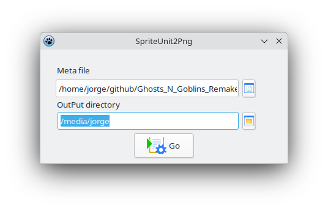

# UnitSprite2CGE

> **UnitSprite2CGE** is a lightweight utility designed for processing *spritesheets*.

The main function of this application is to **read the `.meta` files** generated by the **Unity** game engine for 2D sprites. Using this information, the utility **extracts and separates the individual sprites** from the original image file (typically in PNG format).

---

## 🚀 How to Use (Usage Guide)

1.  **Execution:** Open the `unitysprite2png_gui` application.
2.  **Source Selection:** Select the directory containing the `.meta` file and its corresponding spritesheet (image file).
3.  **Destination Selection:** Select the output directory where the individual extracted sprites will be saved.
4.  **Processing:** Click the **"Go"** button to start the extraction.

**Here's a preview of the application's interface:**

---

## 🛠️ Compiling the Source Code

This application was developed using the **Lazarus IDE** and the **Free Pascal** compiler.

### Compilation Requirements:

To compile the source code, follow these steps:

1.  Install the **Lazarus IDE**.
2.  Install the additional **BGRABitmapPack** package. You can easily do this using the **"Online Package Manager"** option found under the **"Package"** menu in Lazarus.